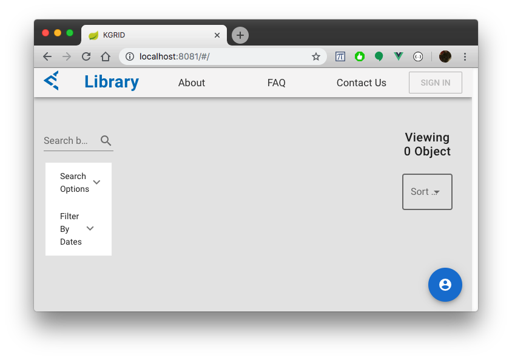
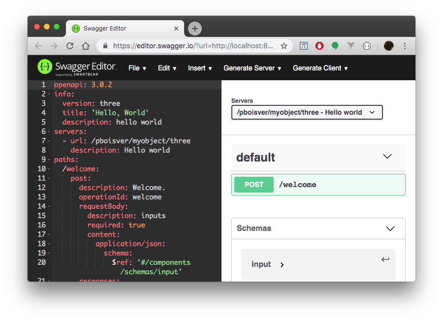

# Developer's Guide

[](https://circleci.com/gh/kgrid/guides)


## Introduction to the Knowledge Grid

The **Knowledge Grid** (KGrid) is an open-source platform for managing and running **computable biomedical knowledge** (CBK).

The kind of knowledge that works well in the KGrid might be risk calculators, computable guidelines, or reference and lookup tables — anything that can be represented as a set of services. A researcher or developer writes code to implement the knowledge as one or more functions, and the resulting code is packaged along with service and deployment descriptions as a **knowledge object** (KO).

::: tip
The fundamental thing the Knowledge Grid does is allow you to externalize key pieces of computable biomedical knowledge that would otherwise be embedded in applications, EHRs, databases, and backend services. This makes it easier to reuse and update that knowledge, across time, for multiple channels, and in many organizations.  
:::

### Basics
KGrid uses a "plugin" model. An **activator** component loads KOs at runtime, extracts and deploys the code to a suitable runtime environment, exposes the service the code implements as a simple RESTful API, and routes requests and responses. The service description (using OpenAPI 3) also specifies the inputs and outputs for the KO.

There is also a **library** component that can be used to manage and browse KOs stored in an archive. Since the activator and the library share a storage mechanism, they are typically deployed together. But one library can serve as a source of KOs for many activators, and one activator can import KOs from many libraries.


This guide will focus on creating and modifying knowledge objects, deploying KOs as services in an activator, and using the services with simple clients.

For more information see [Integrator's guide](../integrator) and [Kgrid platform](../platform).

### How it works

Currently, KGrid supports the embedded JavaScript engine, [Nashorn](https://en.wikipedia.org/wiki/Nashorn_(JavaScript_engine)). Additional runtimes are planned including external Node.js and Python environments, and cloud services like AWS Lambda and Google Cloud for serverless deployments. Knowledge objects are packaged as `.zip` files containing:

 - a top level metadata file (`metadata.json`) containing identifiers and simple descriptive elements; the structural metadata follows the Knowledge Object Information Ontology (KOIO)
 - one or more **implementation** folders with:
   - code artifact(s)
   - an OpenAPI `.yaml` document describing the service interface(s) the object provides
   - a deployment descriptor specifying the runtime environment(s), the entry point, etc.
   - additional metadata specific to the **implementation**

The activator and library are Spring Boot microservices written in Java. The library frontend is a [Vue](https://vuejs.org) Single Page Application (SPA). They can be deployed directly in most environments. We also provide `docker` images for container scenarios.


## Setup

Confirm [Node and NPM](https://nodejs.org) are installed, and [Java 8+ JDK](https://www.oracle.com/technetwork/java/javase/downloads/index.html) is installed

```bash
> node --version
v10.15.3

> java -version
java version "11.0.1" 2018-10-16 LTS
...
```
### Install the [KGrid CLI](https://kgrid.org/kgrid-cli) and set up a workspace

```bash
> npm install -g @kgrid/cli
```

Create a directory to hold your knowledge objects (Kgrid workspace)

```bash
> mkdir myproject
> cd myproject
```

Use KGrid CLI to install a micro-grid in your project directory

```bash
> kgrid setup
KGrid CLI v0.2.1

Setting up kgrid at /Users/pboisver/dev/foof/.kgrid
Downloading kgrid components... done
kgrid setup complete

> kgrid --version
Checking JAVA Version ...
java version "11.0.1" 2018-10-16 LTS
Java(TM) SE Runtime Environment 18.9 (build 11.0.1+13-LTS)
Java HotSpot(TM) 64-Bit Server VM 18.9 (build 11.0.1+13-LTS, mixed mode)

Checking Node Version ...
v10.15.3

Checking KGrid Components Version ...
KGRID Components are installed at: /Users/pboisver/dev/foof/.kgrid
  KGRID Library:   version 1.2.0
  KGRID Activator: version 1.1.0

=========================================================
@kgrid/cli/0.2.1 darwin-x64 node-v10.15.3
```
### Start a local grid

Start KGrid & verify in the browser that the activator and library are running

```bash
> kgrid start
java -jar .../kgrid-library-1.2.0.jar ...  --server.port=8081
java -jar .../kgrid-activator-1.1.0.jar ... --server.port=8080
library: You have the latest version.
Starting KGrid library...
activator: You have the latest version.
Starting KGrid activator...

...
```

::: tip
Once the Library ([http://localhost:8081](http://localhost:8081)) and Activator ([http://localhost:8080](http://localhost:8080)) are running you can open a browser window verify that both are running

The Library will be empty and the Activator should show an empty KO list, `{}`.

:::

You can stop the local micro-grid with `ctrl-C` or open an additional terminal tab or window to continue.

::: tip
For more information on configuring and running local grids see [the KGrid CLI docs](http://kgrid.org/kgrid-cli/#kgrid-setup) or [the Integrator's Guide](../integrator)
:::

## My first object

### Create an object

Open additional terminal tab or window and navigate to the `myproject` folder that you created

Create a new knowledge object using the kgrid-cli. (You will be prompted for an implementation/version identifier — accept any defaults.)

```bash
> kgrid create myobject
...
# coming soon...
# KO implementation `ark:/username/myobject/one` has been created.
# Try `kgrid start` and `kgrid play ark:/username/myobject/one`
```

::: tip
Verify in browser that the new object is displayed in the the Library ([http://localhost:8081](http://localhost:8081)) and Activator ([http://localhost:8080](http://localhost:8080)). (Restart the grid with `kgrid start` if it's not running.)
:::

### Try out the object

::: warning
You may have to reload the Activator after creating or modifying code or metadata. Go to the [`/activate`](http://localhost:8080/activate) endoint in a browser or use `curl localhost:8080/activate` from the command line
:::

```bash
> kgrid play ark:/username/myobject/one
```

::: tip
By default`kgrid play myobject` queries the local activator (http://localhost:8080) and
prompts you to select an implementation. See [KGrid CLI](http://kgrid.org/kgrid-cli/#kgrid-play-ark) for more info.
:::

Once the the Swagger Editor is pointed to `myobject/one`, you'll see the OpenAPI 3 service description and a simple interface for testing the object.



- Select the (green) `POST` operation for the `/welcome` endpoint
- Click on `Try it out`
- The input section should have example inputs filled in:
```
{
  "name": "Bob"
}
```
- Scroll down to the blue `Execute` button and click it
- Scroll down to the response section. You should see a `200` code and a JSON response object
```
{
  "result": "Welcome to Knowledge Grid, Bob",
   ...
}
```
### Change the inputs
Scroll back up to the inputs section and change the `"name"`.
```
{
  "name": "Ted"
}
```
- `Execute` the endpoint operation again. The response body should change.
```
{
  "result": "Welcome to Knowledge Grid, Ted",
   ...
}
```

For more information on the structure of the object, OpenAPI, and activating and using endpoints, see [Anatomy of a KO](#deep-dive-into-the-anatomy-of-a-ko) and the [API guide](../api)

## Unit test the implementation

Make sure you're in the implementation directory and set up the Javascript project.

```bash
> cd myobject/impl
> npm install
```
When the KO was created a simple unit test was added to your object implementation and specifies Jest as a testing dependency (in package.json).

```bash
> npm test

> Implementation@1.0.0 test ../myobject/metadata
> jest

 PASS  test/welcome.test.js
  ✓ hello barney (src) (2ms)

Test Suites: 1 passed, 1 total
Tests:       1 passed, 1 total
Snapshots:   0 total
Time:        1.513s
Ran all test suites.
```

You can add your own tests (in `myobject/metadata/test` directory), and you'll need to update the existing tests in the next section when you change the code.

For more information on the jest framework and unit testing in general see [Jest project](https://jestjs.io/).

## Edit the object

### Metadata

Let's make the object your own! Open the top-level `myobject/metadata.json` file in your favorite editor (try [Atom](https://atom.io/) right now!!) Change the title, description, ..., as follows:

```json
{
    ...
    "title": "Hello World 1",
    "contributors": "Team Wonderface",
    "description": "Best ever, yeah!",
    "keywords": "moose, squirrel",
    ...
}
```
Make sure that the metadata changes are reflected in [the Library](http://localhost:8081) and [the Activator](http://localhost:8080)

Now change the implementation metadata (`myobject/metadata/metadata.json`) to remove title and add a description and keywords

```json
{
    ...
    "description": "First try",
    "keywords": "over, easy",
    ...
}
```
 Check again that the metadata changes are reflected in [the Library](http://localhost:8081) and [the Activator](http://localhost:8080)

For more info on the metadata for KOs and implementations and what's required and/or useful see the [anatomy of a KO](#deep-dive-into-the-anatomy-of-a-ko)

### Changing the code

Let's change the code to reverse the name input.

#### Update the unit test

```javascript
...
test("hello barney (src)", () =>
  {
    expect( welcome({"name": "Barney Rubble"}) )
    .toBe("Welcome to Knowledge Grid, elbbuR yenraB") // reverse the expected result
  })
```
Rerun the test (`npm test`). It should fail.

```bash
> npm test
...
    Expected: "Welcome to Knowledge Grid, elbbuR yenraB"
    Received: "Welcome to Knowledge Grid, Barney Rubble"
```

#### Update the welcome() function

Open up `myobject/impl/src/index.js` in your favorite editor.
```javascript
function welcome(inputs){
 name = inputs.name
  return "Welcome to Knowledge Grid, " + name.split(" ").reverse().join("");
 }
```

Rerun the tests. They should be all green!

#### Try it out

Back to the Swagger Editor (remember to hit the `/activate` endpoint first). If you noticed that the example input `"name": "Bob"` is a palindrome and changed it to `"name": "Ted"` you'll get:
```
{
  "result": "Welcome to Knowledge Grid, deT",
   ...
}
```

### Update the Service Description

Let's make another code change to say "Goodbye" instead of "Welcome". (Remember to update the unit test and rerun the tests.):
```javascript
function byebye(inputs){
 name = inputs.name
  return "Goodbye from the Knowledge Grid, " + name.split("").reverse().join("");
 }
````

Reactivate the object and test it out in the Swagger Editor. **It doesn't work!**

The problem is our object's microAPI endpoint still says `/welcome`. Let's update the OpenAPI service description. Find the `paths:` element in the `myobject/impl/service.yaml` file, and change `/welcome` to `/byebye`:
```yaml
...
paths:
  /byebye:
    post:
      description: So long.
      operationId: seeya
      requestBody:
        description: inputs
        required: true
...
```
Then find `x-kgrid-activation:` element and change  `entry:` to the function name:
```yaml
...
      x-kgrid-activation:
        artifact: src/index.js
        adapter: JAVASCRIPT
        entry: byebye
...
```

Reactivate and then reload the Swagger Editor page and the `POST` endpoint should change to `/byebye`. You should also see the other changes reflected both in the OpenAPI yaml file and the test UI. Of course the object title is still "Hello' World" — fixing that is left as an exercise. (Hint: you may need to change elements of the metadata and the service description.)

For more on creating and implementing API descriptions see [OpenAPI](), [Anatomy of a KO](), etc.


## What's next?
Now, you learned the basics of Knowledge Grid. [KGRID SCORE tutorial](../tutorial/) will guide you through the process of developing a KO implementing SCORE risk calculation. The tutorial will also cover a wide range of advanced topics. 
