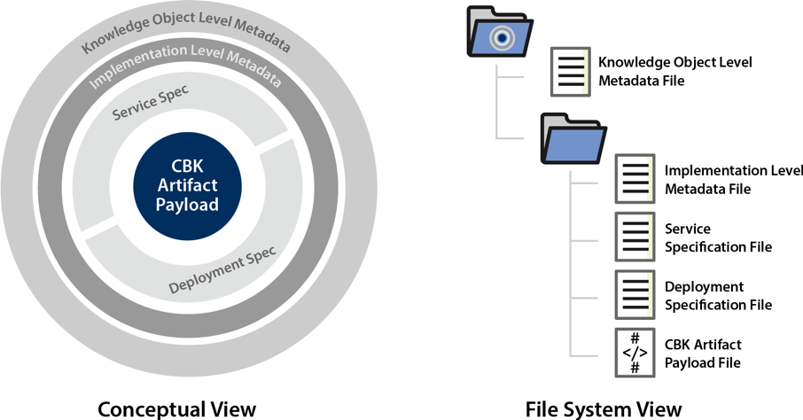

# Knowledge Object Overview

Conceptually, a knowledge object represents computable knowledge as both a resource and a service. That is, it contains description of what it does, and the code to do it. Also, in order to make the object **f**indable, **a**ccessible, **i**nteroperable, and **r**eusable (FAIR), the KO has enough metadata to describe itself as both resource and service.

Here's a picture....

----


----

Let's take a look at what's inside a knowledge object ....

```
├── js-simple-v1.0
    ├── metadata.json
    ├── service.yaml
    ├── deployment.yaml
    └── src
        └── index.js

```

## Metadata

In the packaged object, metadata is kept in a `json` file.

Metadata includes an identifier, minimal description data, and required knowledge object properties from the [Knowledge Object Implementation Ontology (KOIO)](koio)

`js-simple-v1.0/metadata.json`
```json
{
  "@id": "js/simple/v1.0",
  "@type":"koio:KnowledgeObject",
  "identifier": "ark:/js/simple/v1.0",
  "version":"v1.0",
  "title": "Hello world",
  "description":"An example of simple Knowledge Object",
  "keywords":["Hello","example"],
  "hasServiceSpecification": "service.yaml",
  "hasDeploymentSpecification": "deployment.yaml",
  "hasPayload": "src/index.js",
  "@context" : ["http://kgrid.org/koio/contexts/knowledgeobject.jsonld" ]
}
```

Descriptive metadata elements like `title` or `description`, administrative metadata like `identifier`, and technical metadata like the `koio:KnowledgeObject` are described in [the Metadata section in KGrid Common Object Package specifications](https://kgrid.org/specs/packaging.html#metadata-json). We recommend using standard *dcterms* metadata elements, or similar. Some items may be required. You may add additional descriptive or domain specific metadata elements as needed. We recommend you use standard vocabularies and express them in the `context` element so as to enable metadata use in linked data scenarios.
